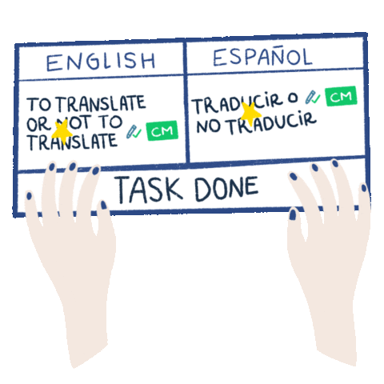
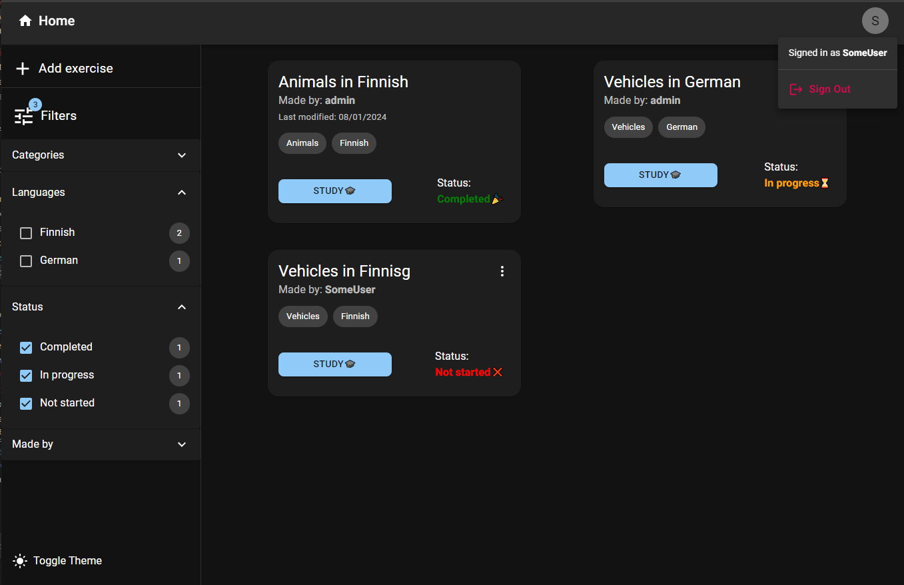
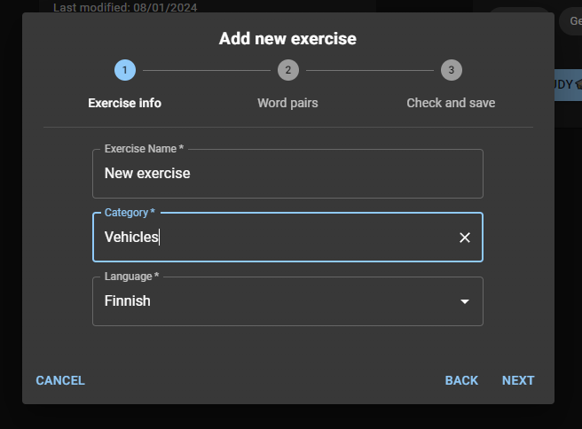
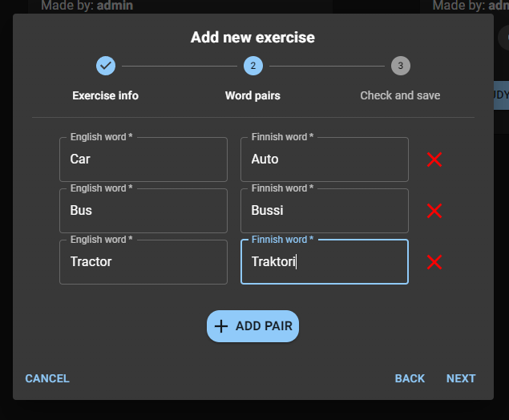
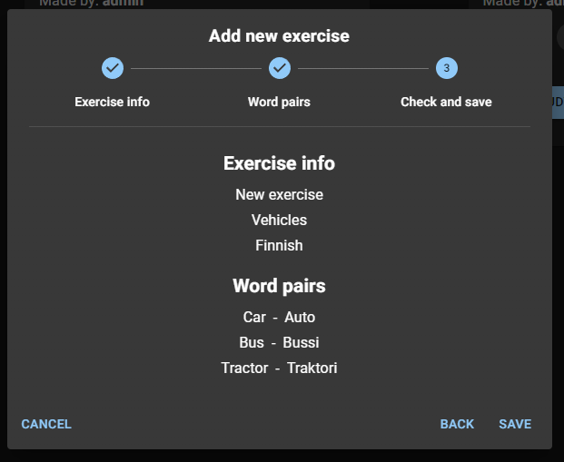
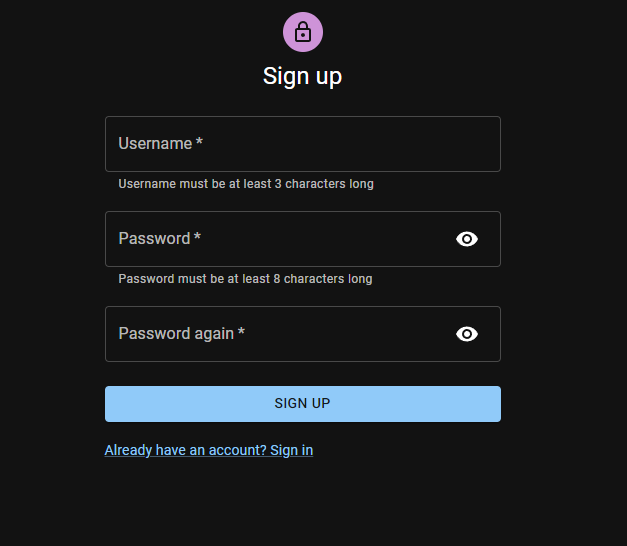
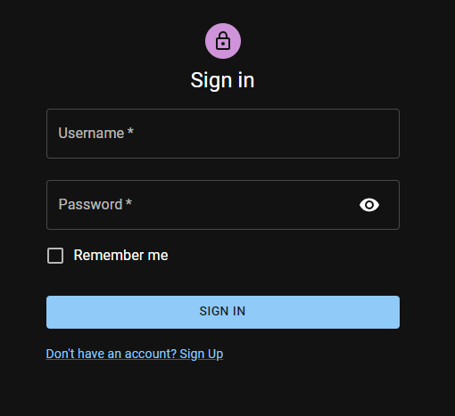
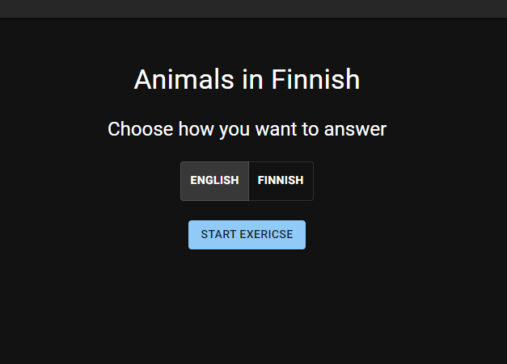
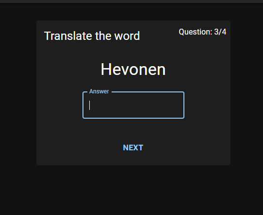
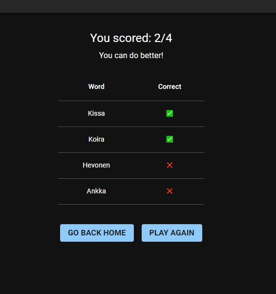

# Language learning app!

## About

This app provides quiz styled learning experience for learning the basics of different languages.

The app is aimed for younger users to learn languages in a more interesting way.  
Parents / teachers can sign up and create language exercises.

App was made as part of TAMK's Backend Development courses end project.

#### <ins>Technologies used:</ins>

## Features

- Sign in / sign up authorization
- Users can create new exercises
- Users can modify / delete only the exercises they have created
- UI made by using material.ui
- Dark / light theme
- Responsive UI
- End user can filter exercises based on multiple choices such as category, language, exercise status or the creator of the exercise
- Exercises are quiz styled and users score and right / wrong answers will be displayed after the exercise

## Usage

### <ins>Cloud</ins>
Learn languages is deployed to [Render](https://learn-languages.onrender.com/)  
(Loading may take a while)

### <ins>Locally</ins>
1. Clone this repository
2. When in root directory, install dependencies: `npm run install-all`
3. Start the app while in root directory: `npm run start`
4. Head to [localhost](http:localhost:5173)

## Pictures

### Overview

---

### Adding new exercise

---

### Sign up / sign in page

---

### Quiz exercise

## Author
Mikko Pasanen <mikko.pasanen@tuni.fi>

